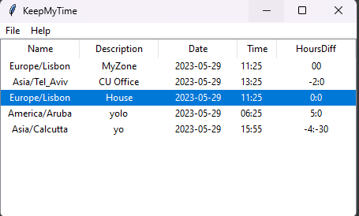

# App Themes

App themes are provided via [ttkthemes](https://ttkthemes.readthedocs.io/en/latest/themes.html)

For full themes available have a look at the official [ttkthemes](https://ttkthemes.readthedocs.io/en/latest/themes.html) site.

### Not all themes were tested.

## Some tested themes:

### 1. Default - no theme applied 

`None-TimeZones.json`

### 2. yaru 

`yaru-TimeZones.json`

### 3. plastik 

`plastik-TimeZones.json`

### 4. equilux 

`equilux-TimeZones.json`

