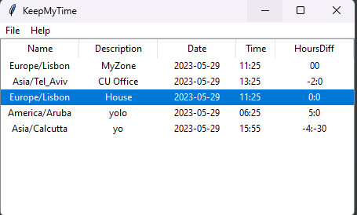
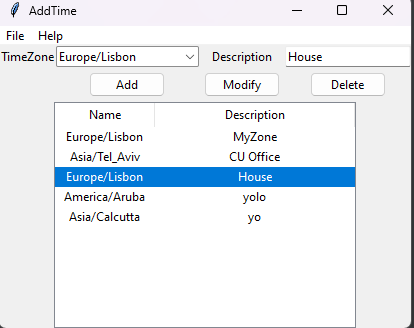

# MyTimeZones
A simple Python Tkinter app to always know who is what time zone

# Problem
You work with people across the world and YOU always forget what time zone they are
# Solution
Just have a short list that shows their time zone and time difference versus yours.

### Always see who is where and what is the difference:



### Modify/Add any time-zone




## How it works:

The `MyTimeZones.exe` needs a `none-timezones.json` file next to it.

### none-timezones.json

#### Theme

The first part of the name will provide the app theme.

'none-Timezones.json' will five you the default themes.

For some sampels go to Themes.

#### Json content

This file contains the information needed for the app to run:

```json
{
    "local": {
        "description": "MyZone",
        "zone": "Europe/Lisbon"
    },
    "others": [
        {
            "description": "CU Office",
            "zone": "Asia/Tel_Aviv"
        },
        {
            "description": "House",
            "zone": "Europe/Lisbon"
        },
        {
            "description": "yolo",
            "zone": "America/Aruba"
        },
        {
            "description": "yo",
            "zone": "Asia/Calcutta"
        }
    ]
}```