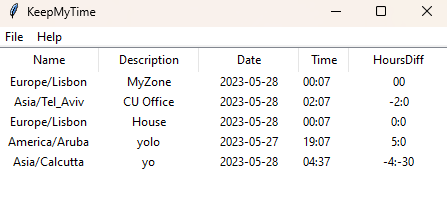

# MyTimeZones
A simple Python Tkinter app to always know who is what time zone

# Problem
You work with people across the world and YOU always forget what time zone they are
# Solution
Just have a short list that shows their time zone and time difference versus yours.

## Always see who is where and what is the difference:

## Modify/Add any time-zone

